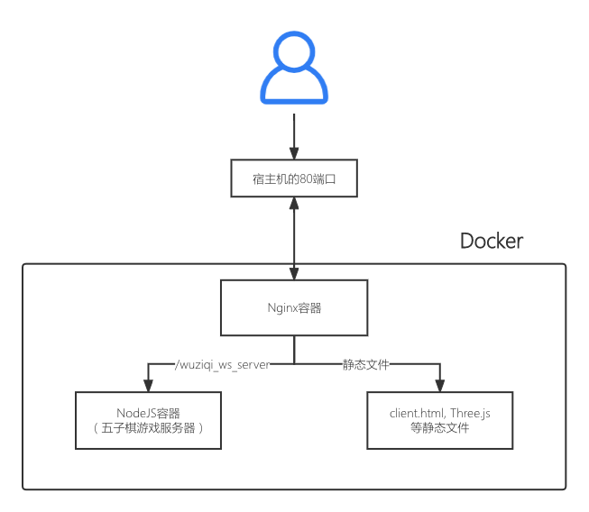
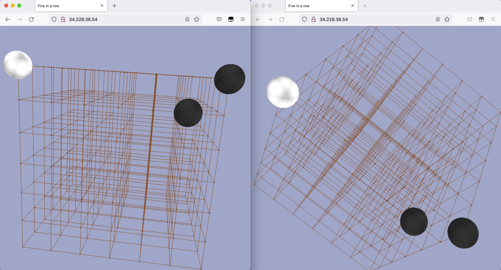
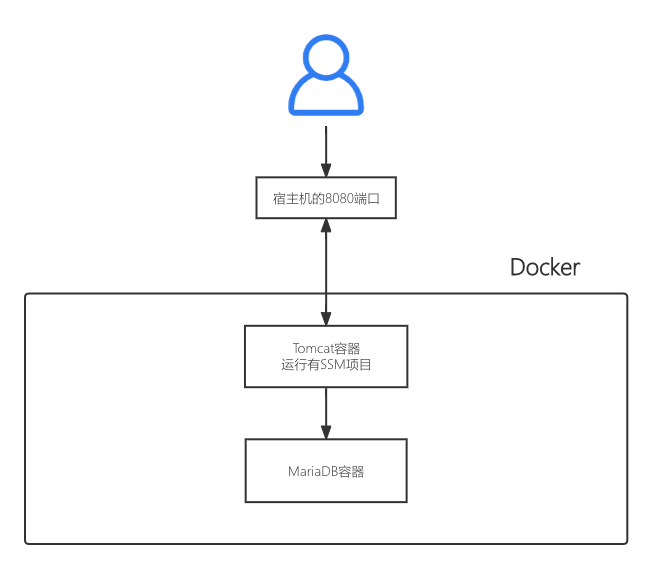

# 高级Web技术 Lab1 实验文档

19302010021 张皓捷

## Lab1运行方法

我为五子棋和ssm两个项目都写好了各自的Dockerfile和docker-compose.yml

lab1的目录结构如下所示

```
├── ssm_demo_do
│   ├── docker-compose.yml
│   ├── mysql
│   │   ├── Dockerfile
│   │   ├── entrypoint.sh
│   │   ├── mariadb.cnf
│   │   └── sys_schema.sql
│   └── ssm-demo
│       └── code
└── wuziqi_do
    ├── docker-compose.yml
    ├── nginx
    │   ├── Dockerfile
    │   ├── nginx.conf
    │   └── static
    └── wuziqi
        ├── ChessServer.js
        └── Dockerfile
```

### 运行五子棋

进入wuziqi_do目录，运行以下指令

```bash
docker compose build
docker compose up
```

通过

```
http://主机名称
```

即可访问到五子棋项目

### 运行ssm

进入ssm_demo_do目录，运行以下指令

```bash
docker compose build
docker compose up
```

通过

```
http://主机名称:8080
```

即可访问到ssm项目

## VPC创建成功截图


## 子网创建成功截图


## 路由表创建成功截图


## 五子棋项目的部署

我将原来的ClientPage.html放在nginx服务器上作为静态文件，这样用户可以直接通过我们的主机名访问在线五子棋项目，而不需要另外将五子棋的客户端分发给用户

### 项目架构



### 在NodeJS容器中运行五子棋服务器

```dockerfile
FROM node:16
RUN mkdir -p /huajuan/wuziqi
WORKDIR /huajuan/wuziqi
COPY "./ChessServer.js" "/huajuan/wuziqi"
RUN npm install websocket && npm install ws
CMD ["node" ,"/huajuan/wuziqi/ChessServer.js" ]
```

### 运行并配置Nginx容器

```dockerfile
FROM nginx:1.21.6
RUN mkdir /huajuan
COPY ./static /huajuan #复制静态文件到nginx容器中
COPY ./nginx.conf /etc/nginx/nginx.conf #复制nginx配置文件
```

```
		map $http_upgrade $connection_upgrade {
        default upgrade;
        '' close;
    }
    server {
        listen 80;
        server_name 127.0.0.1;

        location /wuziqi_ws_server {
            proxy_pass http://wuziqi_ws_server:8080/wuziqi_ws_server;
            proxy_http_version 1.1;
            proxy_set_header Upgrade $http_upgrade;
            proxy_set_header Connection $connection_upgrade;
        }

        location / {
            root /huajuan;
            index client.html;
        }
    }
```

### 运行成功的截图



## SSM项目的部署

### 项目架构



### 在容器中运行SSM项目

```dockerfile
FROM maven
ENV CATALINA_HOME /usr/local/tomcat
ENV PATH $CATALINA_HOME/bin:$PATH
RUN mkdir -p "$CATALINA_HOME"
WORKDIR $CATALINA_HOME
ENV TOMCAT_VERSION 8.5.77
ENV TOMCAT_TGZ_URL https://dlcdn.apache.org/tomcat/tomcat-8/v$TOMCAT_VERSION/bin/apache-tomcat-$TOMCAT_VERSION.tar.gz
RUN set -x \
&& curl -fSL "$TOMCAT_TGZ_URL" -o tomcat.tar.gz \
&& tar -xvf tomcat.tar.gz --strip-components=1 \
&& rm bin/*.bat \
&& rm tomcat.tar.gz*

ADD pom.xml /tmp/build/
RUN cd /tmp/build && mvn dependency:resolve

ADD src /tmp/build/src
        #构建应用
RUN cd /tmp/build && mvn -DskipTests=true package \
        #拷贝编译结果到指定目录
	&& rm -rf $CATALINA_HOME/webapps/* \
        && mv target/*.war $CATALINA_HOME/webapps/ROOT.war \
        #清理编译痕迹
        && cd / && rm -rf /tmp/build

CMD ["catalina.sh", "run"]
```

### 在容器中运行mariadb数据库

使用环境变量将root密码设为123456。

容器启动时，运行.sql文件在mariadb中创建表结构。

```dockerfile
FROM mariadb
ENV MARIADB_ROOT_PASSWORD 123456
RUN mkdir /huajuan
EXPOSE 3306
COPY "./mariadb.cnf" "/etc/mysql/mariadb.cnf" #配置utf8编码，否则会乱码
COPY "./sys_schema.sql" "/docker-entrypoint-initdb.d/" #容器初始化时运行.sql文件，生成表结构
```

### Docker-Compose运行整个项目

ssm_demo是有Java程序的容器，ssm_mariadb是数据库容器。

使用links字段，将ssm_demo和ssm_mariadb两个容器互联；使用depends_on字段指明ssm_demo是依赖于ssm_mariadb的。

将ssm_demo的8080端口映射到宿主机的8888端口供访问。

将ssm_mariadb的/var/lib/mysql目录映射到宿主机的./container_data/mysql/data目录以实现数据持久化，防止因为数据库容器删除，导致数据库中数据全部丢失的情况。

```yaml
version: '3'
services:
  mysql:
    build: ./mysql/
    container_name: ssm_mariadb
    environment:
      MYSQL_ROOT_PASSWORD: "123456"
    volumes:
      - "./container_data/mysql/data:/var/lib/mysql"
  ssm_demo:
    build: ./ssm-demo/code/
    container_name: ssm_demo
    ports:
      - "8888:8080"
    links: #容器互联
      - mysql
    depends_on: #容器依赖关系
      - mysql
```

### 部署成功的截图

