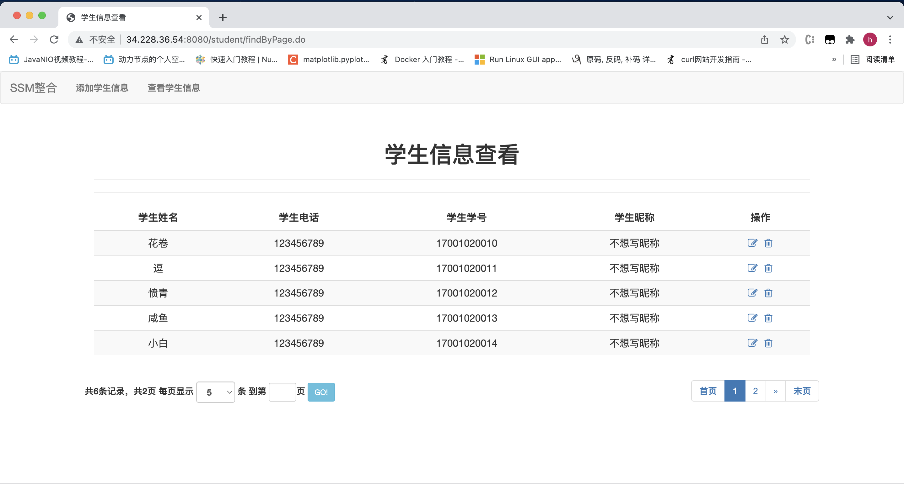

# 高级Web技术 Lab1 实验文档

19302010021 张皓捷

## VPC创建成功截图


## 子网创建成功截图


## 路由表创建成功截图


## 五子棋项目的部署

### 静态文件服务器

我变更了原来五子棋项目中的文件结构，static文件夹为静态文件服务器的路径。这样客户端client.html也可以直接从服务器上获得，而不需要另外分发给用户。

```
wuziqi_do
├── docker-compose.yml
└── wuziqi
    ├── Dockerfile
    ├── content
    │   ├── ChessServer.js
    │   └── static
    │       ├── CilentPage.html.bak
    │       ├── Three.js
    │       ├── TrackballControls.js
    │       └── client.html
    └── content.tar.gz
```

用nodejs实现一个简单的静态文件服务器。

```javascript
var url=require('url')
var path=require('path')
var fs=require('fs')
var server=http.createServer(function(req,rsp){
    let urlObj=url.parse(req.url)
    let urlPathname=urlObj.pathname
    let filePathname=path.join(__dirname,"/static",urlPathname)
    console.log(filePathname)

    fs.readFile(filePathname,(err,data)=>{
        if(err){
            rsp.writeHead(404)
            rsp.write('404 - File is not found!')
            rsp.end()
        }else{
            rsp.writeHead(200)
            rsp.write(data)
            rsp.end()
        }
    })
});
```

### 使用Dockerfile构建和Docker-Compose部署

#### Dockerfile

从nodejs的image开始构建。将源代码复制到容器内，并使用npm安装websocket等组件。最后用node启动服务器。

```dockerfile
FROM node:16
RUN mkdir -p /huajuan/wuziqi
COPY "./content.tar.gz" "/huajuan/wuziqi"
WORKDIR /huajuan/wuziqi
RUN  tar -zxvf ./content.tar.gz
WORKDIR /huajuan/wuziqi/content
RUN npm install websocket && npm install ws
CMD ["node" ,"/huajuan/wuziqi/content/ChessServer.js" ]
```

#### Docker-Compose

使用Docker-Compose，将node容器的8080端口映射到宿主机的8080端口。

```yaml
version: '3'
services:
  wuziqi_node:
    build: ./wuziqi
    container_name: wuziqi_node_container
    ports:
      - "8080:8080"
```

### 部署成功的截图


## SSM项目的部署

### 在容器中运行SSM项目

```dockerfile
FROM maven
ENV CATALINA_HOME /usr/local/tomcat
ENV PATH $CATALINA_HOME/bin:$PATH
RUN mkdir -p "$CATALINA_HOME"
WORKDIR $CATALINA_HOME
ENV TOMCAT_VERSION 8.5.77
ENV TOMCAT_TGZ_URL https://dlcdn.apache.org/tomcat/tomcat-8/v$TOMCAT_VERSION/bin/apache-tomcat-$TOMCAT_VERSION.tar.gz
RUN set -x \
&& curl -fSL "$TOMCAT_TGZ_URL" -o tomcat.tar.gz \
&& tar -xvf tomcat.tar.gz --strip-components=1 \
&& rm bin/*.bat \
&& rm tomcat.tar.gz*

ADD pom.xml /tmp/build/
RUN cd /tmp/build && mvn dependency:resolve

ADD src /tmp/build/src
        #构建应用
RUN cd /tmp/build && mvn -DskipTests=true package \
        #拷贝编译结果到指定目录
	&& rm -rf $CATALINA_HOME/webapps/* \
        && mv target/*.war $CATALINA_HOME/webapps/ROOT.war \
        #清理编译痕迹
        && cd / && rm -rf /tmp/build

CMD ["catalina.sh", "run"]
```

### 在容器中运行mariadb数据库

使用环境变量将root密码设为123456。

容器启动时，运行.sql文件在mariadb中创建表结构。

```dockerfile
FROM mariadb
ENV MARIADB_ROOT_PASSWORD 123456
RUN mkdir /huajuan
EXPOSE 3306
COPY "./mariadb.cnf" "/etc/mysql/mariadb.cnf" #配置utf8编码，否则会乱码
COPY "./sys_schema.sql" "/docker-entrypoint-initdb.d/" #容器初始化时运行.sql文件，生成表结构
```

### Docker-Compose运行整个项目

ssm_demo是有Java程序的容器，ssm_mariadb是数据库容器。

使用links字段，将ssm_demo和ssm_mariadb两个容器互联；使用depends_on字段指明ssm_demo是依赖于ssm_mariadb的。

将ssm_demo的8080端口映射到宿主机的8888端口供访问。

将ssm_mariadb的/var/lib/mysql目录映射到宿主机的./container_data/mysql/data目录以实现数据持久化，防止因为数据库容器删除，导致数据库中数据全部丢失的情况。

```yaml
version: '3'
services:
  mysql:
    build: ./mysql/
    container_name: ssm_mariadb
    environment:
      MYSQL_ROOT_PASSWORD: "123456"
    volumes:
      - "./container_data/mysql/data:/var/lib/mysql"
  ssm_demo:
    build: ./ssm-demo/code/
    container_name: ssm_demo
    ports:
      - "8888:8080"
    links: #容器互联
      - mysql
    depends_on: #容器依赖关系
      - mysql
```

### 部署成功的截图

